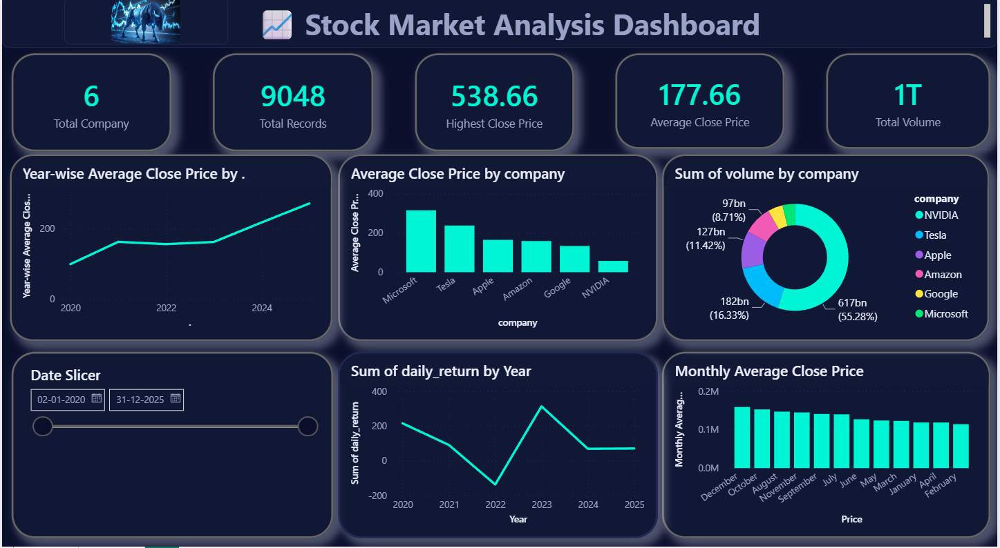
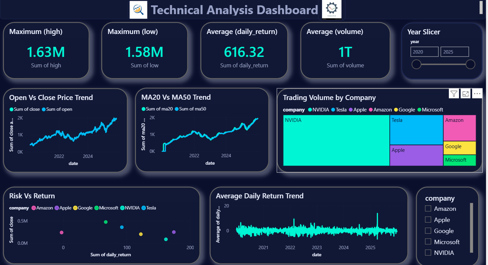

# 📈 Stock Market Analytics Dashboard

> **End-to-End Stock Market Analytics Project using Python, PostgreSQL, SQL & Power BI**

An end-to-end Data Analytics project that collects real-world stock market data, cleans and transforms it using Python, stores it in PostgreSQL, performs SQL analysis, and visualizes business insights with interactive Power BI dashboards.

---

# 📷 Dashboard Preview

## 📊 Stock Market Analysis Dashboard



---

## 📈 Technical Analysis Dashboard



---

# 🚀 Project Workflow

```text
Yahoo Finance API
        │
        ▼
Python Data Collection
        │
        ▼
Data Cleaning & Feature Engineering
        │
        ▼
CSV Dataset
        │
        ▼
PostgreSQL Database
        │
        ▼
SQL Analysis
        │
        ▼
Power BI Dashboard
        │
        ▼
Business Insights
```

---

# 📌 Project Overview

This project demonstrates the complete Data Analytics lifecycle, from collecting raw stock market data to building professional Power BI dashboards.

Historical stock data of six leading technology companies is analyzed to discover trends, compare performance, evaluate daily returns, and generate meaningful business insights.

---

# 🎯 Objectives

- Analyze stock market performance
- Compare multiple companies
- Analyze yearly & monthly trends
- Calculate Daily Return
- Generate Moving Averages (MA20 & MA50)
- Build interactive Power BI dashboards
- Generate business insights

---

# 🛠 Tech Stack

| Tool | Purpose |
|------|----------|
| Python | Data Collection |
| Pandas | Data Cleaning |
| yFinance API | Stock Data |
| PostgreSQL | Database |
| SQL | Data Analysis |
| Power BI | Dashboard |
| Git & GitHub | Version Control |

---

# 📂 Repository Structure

```text
Stock-Market-Analytics
│
├── data_cleaning.py
├── download_stock_data.py
├── stock_market_analysis.sql
├── stock_data.csv
├── stock_data_cleaned.csv
├── Stock_Market_Analytics.pbix
├── dashboard1.png
├── dashboard2.png
└── README.md
```

---

# 📊 Dashboard 1

### KPI Cards

- ✅ Total Companies
- ✅ Total Records
- ✅ Highest Close Price
- ✅ Average Close Price
- ✅ Total Trading Volume

### Visualizations

- Average Close Price by Company
- Year-wise Average Close Price
- Monthly Average Close Price
- Trading Volume Distribution
- Daily Return Trend
- Date Slicer

---

# 📈 Dashboard 2

### KPI Cards

- ✅ Highest High Price
- ✅ Lowest Low Price
- ✅ Average Daily Return
- ✅ Average Trading Volume

### Visualizations

- Open vs Close Price Trend
- MA20 vs MA50 Trend
- Trading Volume Treemap
- Risk vs Return
- Average Daily Return Trend
- Company Filter
- Year Filter

---

# 📊 Dataset Information

### Source

Yahoo Finance API

### Companies

- Apple
- Microsoft
- Google
- Amazon
- Tesla
- NVIDIA

### Time Period

2020 – 2025

---

# 🧹 Data Cleaning & Feature Engineering

The following features were created using Python:

- Daily Return
- Price Change
- Year
- Month
- Day
- Moving Average (20 Days)
- Moving Average (50 Days)

Missing values were handled before loading the data into PostgreSQL.

---

# 🗄 PostgreSQL Database

### Database

```text
stock_market_db
```

### Table

```text
stock_data
```

### Columns

- Date
- Company
- Open
- High
- Low
- Close
- Volume
- Year
- Month
- Day
- Price Change
- Daily Return
- MA20
- MA50

---

# 🔍 SQL Analysis

SQL queries were written to analyze:

- Total Records
- Total Companies
- Company-wise Records
- Highest Closing Price
- Average Closing Price
- Trading Volume
- Daily Return
- Moving Average

---

# 📈 Key Insights

- 📌 Microsoft recorded the highest average closing price.
- 📌 NVIDIA contributed the highest trading volume.
- 📌 Moving averages reveal long-term trends.
- 📌 Daily Return helps identify stock volatility.
- 📌 Company-wise comparison improves investment analysis.

---

# 🚀 Future Enhancements

- Live Stock Market Data
- Real-Time Dashboard
- Machine Learning Forecasting
- Power BI Service Deployment
- Interactive Web Dashboard

---

# 👨‍💻 Author

## Sharad Savita

**MCA Student | Data Analyst | Power BI Developer | SQL & Python Enthusiast**

### 🔗 Connect with Me

**GitHub**

https://github.com/sharadsavita

**LinkedIn**

https://www.linkedin.com/in/sharad-savita-a08955368

---

⭐ **If you like this project, don't forget to give it a Star!**
